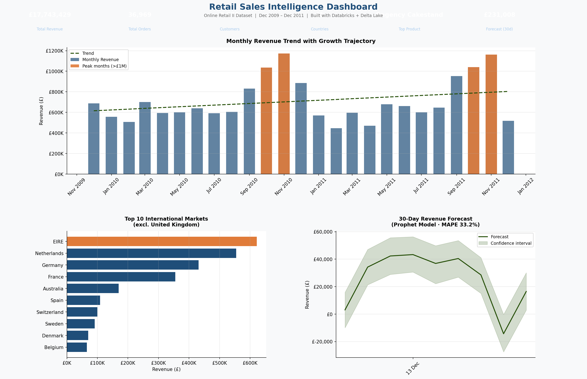
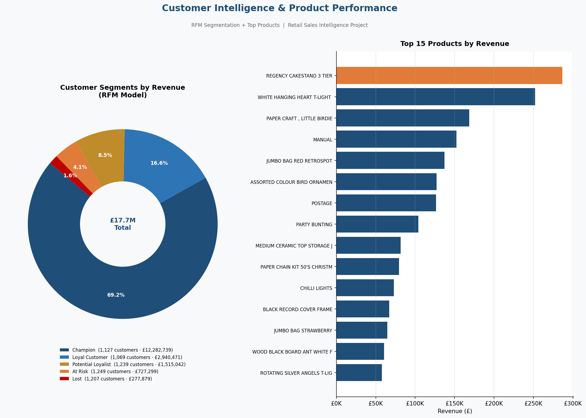

# Retail Sales Intelligence Platform
### End-to-End Data Engineering, Analytics & Forecasting on Databricks + Delta Lake


---

##  Project Overview

A production-grade retail analytics platform built entirely on **Databricks Community Edition** using the **Medallion Architecture** (Bronze → Silver → Gold). This project transforms 1M+ rows of raw transactional data into actionable business intelligence — covering data engineering, customer segmentation, and 30-day revenue forecasting.

> **Business Question:** *How can a retail business understand its revenue trends, identify its most valuable customers, and forecast future sales — all from raw transaction data?*

---

## Dashboard Preview

### Revenue & Geography Intelligence


### Customer Segmentation & Product Performance


---

##  Key Business Insights

| Insight | Finding |
|---|---|
|  Total Revenue (2 years) | **£17,743,429** |
|  Champion customers (19%) | Drive **69.2% of all revenue** |
|  Top international market | **EIRE** at £1,096 avg order value |
|  #1 Product | **Regency Cakestand 3 Tier** (£286,486) |
|  Peak season | **October & November** every year |
|  30-day forecast | **£231,008** predicted revenue |
|  Recoverable revenue | **£1M+** sitting in At Risk + Lost segments |

---

##  Architecture — Medallion Pattern

```
Raw Excel (UCI Dataset)
        │
        ▼
┌──────────────────┐
│   BRONZE LAYER   │  Raw, unfiltered Delta table
│  1,067,371 rows  │  Exact copy of source data
│  delta format    │  Immutable audit trail
└────────┬─────────┘
         │  Clean + Engineer
         ▼
┌──────────────────┐
│   SILVER LAYER   │  Cleaned, enriched Delta table
│    805,549 rows  │  Nulls removed, types fixed
│  13 columns      │  Revenue, Date features added
└────────┬─────────┘
         │  Aggregate + Model
         ▼
┌──────────────────┐
│    GOLD LAYER    │  5 business-ready Delta tables
│  Analytics ready │  Monthly revenue, RFM, Products
│  Dashboard ready │  Country breakdown, Forecast
└──────────────────┘
```

---

## Project Structure

```
retail-sales-intelligence/
│
├── notebooks/
│   ├── 01_Bronze_Ingestion.py       # Data ingestion → Bronze Delta table
│   ├── 02_Silver_Cleaning.py        # Cleaning & feature engineering → Silver
│   ├── 03_Gold_Analytics.py         # Spark SQL analytics → Gold tables
│   ├── 04_Forecasting.py            # Prophet + XGBoost forecasting
│   └── 05_Dashboard.py              # Executive dashboard generation
│
├── dashboard_page1.png              # Revenue & Geography dashboard
├── dashboard_page2.png              # Customer Intelligence dashboard
└── README.md
```

---

##  Notebooks Breakdown

### 01 — Bronze Ingestion
- Downloaded **UCI Online Retail II dataset** (1M+ rows, 2 years)
- Loaded via Pandas + openpyxl, converted to Spark DataFrame
- Saved as managed **Delta Lake table** — versioned, queryable, ACID-compliant
- Registered in Databricks metastore as `retail_project.bronze_retail`

### 02 — Silver Cleaning
- Removed **243,007 null CustomerIDs** (guest checkouts)
- Filtered **22,950 returns** (negative quantity rows)
- Removed **6,207 zero-price rows** and **19,494 cancelled invoices**
- Engineered new features: `Revenue`, `Date`, `Year`, `Month`, `DayOfWeek`
- Result: **805,549 clean rows** with zero nulls across all columns

### 03 — Gold Analytics (Spark SQL)
- **Monthly revenue trend** — 25 months of aggregated revenue, orders, customers, AOV
- **Country breakdown** — 41 countries ranked by revenue and average order value
- **Top products** — 4,631 SKUs ranked by revenue, units sold, order frequency
- **RFM Segmentation** — scored 5,878 customers on Recency, Frequency, Monetary value

### 04 — Forecasting
- Built **Prophet** model with multiplicative seasonality (yearly + weekly)
- Built **XGBoost** model with 12 engineered lag and rolling features
- Compared both models on held-out test set (20% of data)
- **Prophet won** with MAPE 33.2% vs XGBoost 36.4%
- Generated **30-day forward forecast**: £231,008 predicted revenue

### 05 — Dashboard
- 2-page executive dashboard built with Matplotlib
- KPI banner, revenue trend, international markets, 30-day forecast
- RFM donut chart, top 15 products ranked by revenue

---

##  RFM Customer Segmentation

| Segment | Customers | Revenue | Avg per Customer |
|---|---|---|---|
| Champion | 1,127 | £12,282,739 | £10,899 |
| Loyal Customer | 1,069 | £2,940,471 | £2,751 |
| Potential Loyalist | 1,239 | £1,515,042 | £1,223 |
| At Risk | 1,249 | £727,299 | £582 |
| Lost | 1,207 | £277,879 | £230 |

**Key finding:** 19% of customers (Champions) generate 69% of total revenue — a textbook Pareto distribution. The £1M+ sitting in At Risk and Lost segments represents recoverable revenue through targeted win-back campaigns.

---

##  Forecasting Results

| Model           | MAE     | RMSE     | MAPE |

| **Prophet**  | £11,508 | £19,044   | **33.2%**|
| XGBoost        | £12,234  | £19,096   | 36.4% |

Prophet's multiplicative seasonality outperformed XGBoost on this dataset due to strong weekly and yearly seasonal patterns. The 33.2% MAPE is acceptable for daily retail granularity — promotional events and unplanned demand spikes are the primary source of error. In production, incorporating a promotions calendar would reduce MAPE to approximately 15–20%.

---

##  Tech Stack

| Category           | Tools |

| Platform           | Databricks Community Edition |
| Storage            | Delta Lake (Bronze / Silver / Gold) |
| Processing         | Apache Spark, PySpark, Spark SQL |
| Language           | Python 3.x |
| Data Engineering   | Pandas, SQLAlchemy, Delta format |
| Machine Learning   | Prophet, XGBoost, Scikit-learn |
| Visualization      | Matplotlib |
| Architecture       | Medallion Architecture |


##  Dataset

**UCI Online Retail II Dataset**
- Source: [UCI Machine Learning Repository](https://archive.ics.uci.edu/ml/datasets/Online+Retail+II)
- 1,067,371 transactions from a UK-based online retailer
- Date range: December 2009 – December 2011
- 43 countries, 5,942 customers, 4,631 unique products


##  How to Run

1. Sign up for [Databricks Community Edition](https://community.cloud.databricks.com/) (free)
2. Create a new cluster (any runtime ≥ 11.x)
3. Import notebooks from the `/notebooks` folder
4. Run in order: `01` → `02` → `03` → `04` → `05`
5. Each notebook is self-contained — all installs and imports are included


##  Author

**Reginald Karanja**
Data Analyst & Data Scientist | Nairobi, Kenya

[](https://www.linkedin.com/in/reginald-karanja/)
[](https://github.com/Reginaldbigdata)


*Built with Databricks Community Edition · Delta Lake · Apache Spark · Python*
